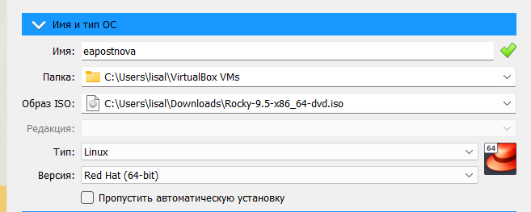
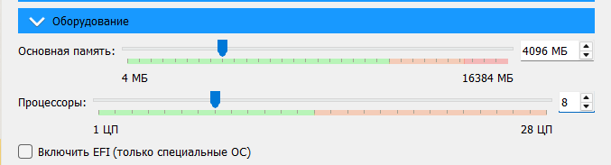
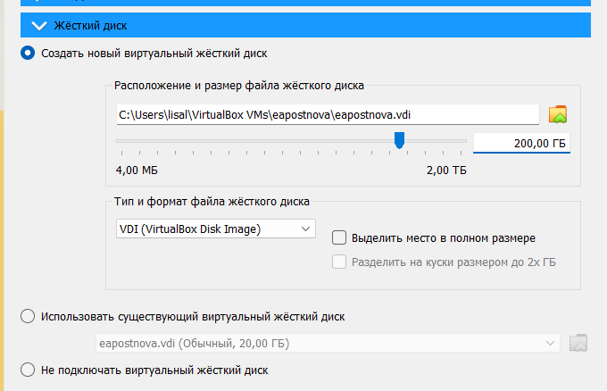
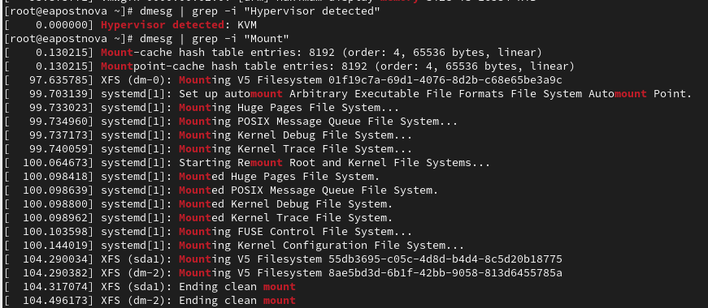
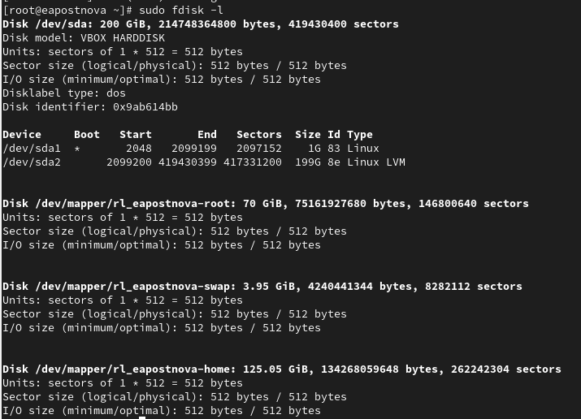

---
## Front matter
lang: ru-RU
title: "Отчёт по лабораторной работе №1"
subtitle: "Основы информационной безопасности"
author:
  - Постнова Елизавета Андреевна, НКАбд-04-23
institute:
  - Российский университет дружбы народов, Москва, Россия

## i18n babel
babel-lang: russian
babel-otherlangs: english

## Formatting pdf
toc: false
toc-title: Содержание
slide_level: 2
aspectratio: 169
section-titles: true
theme: metropolis
header-includes:
 - \metroset{progressbar=frametitle,sectionpage=progressbar,numbering=fraction}
---

# Цель работы

Целью данной работы является приобретение практических навыков
установки операционной системы на виртуальную машину, настройки минимально необходимых для дальнейшей работы сервисов.

# Задание

1. Установка операционной системы на виртуальную машину, настройки минимально необходимых для дальнейшей работы сервисов.

2. Получить следующую информацию.

Версия ядра Linux (Linux version).

Частота процессора (Detected Mhz processor).

Модель процессора (CPU0).

Объем доступной оперативной памяти (Memory available).

Тип обнаруженного гипервизора (Hypervisor detected).

Тип файловой системы корневого раздела.

Последовательность монтирования файловых систем

# Выполнение лабораторной работы

Создайте новую виртуальную машину. Укажите имя виртуальной машины, тип
операционной системы — Linux, RedHat (64-bit). Укажите размер основной памяти виртуальной машины — 4096 МБ.
Задайте конфигурацию жёсткого диска — загрузочный,VDI (BirtualBox Disk
Image), динамический виртуальный диск.
Задайте размер диска — 200 ГБ).

{#fig:001 width=70%}

{#fig:001 width=70%}

{#fig:001 width=70%}

Запустите виртуальную машину, выберите English в качестве
языка интерфейса и перейдите к настройкам установки операционной системы.
Войдите в ОС под заданной вами при установке учётной записью. В меню
Устройства виртуальной машины подключите образ диска дополнений гостевой ОС.

Дождитесь загрузки графического окружения и откройте терминал. В окне
терминала проанализируйте последовательность загрузки системы, выполнив команду dmesg.

Получите следующую информацию.
1. Версия ядра Linux (Linux version).
2. Частота процессора (Detected Mhz processor).
3. Модель процессора (CPU0).
4. Объем доступной оперативной памяти (Memory available).
5. Тип обнаруженного гипервизора (Hypervisor detected).
6. Тип файловой системы корневого раздела.

{#fig:001 width=70%}

{#fig:001 width=70%}

{#fig:001 width=70%}

# Выводы

В результате данной работы я приобрела практические навыки
установки операционной системы на виртуальную машину, настройки минимально необходимых для дальнейшей работы сервисов.

