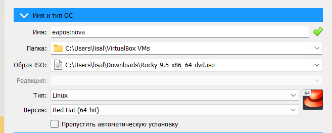
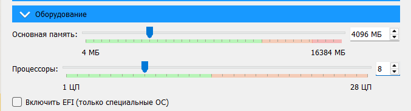
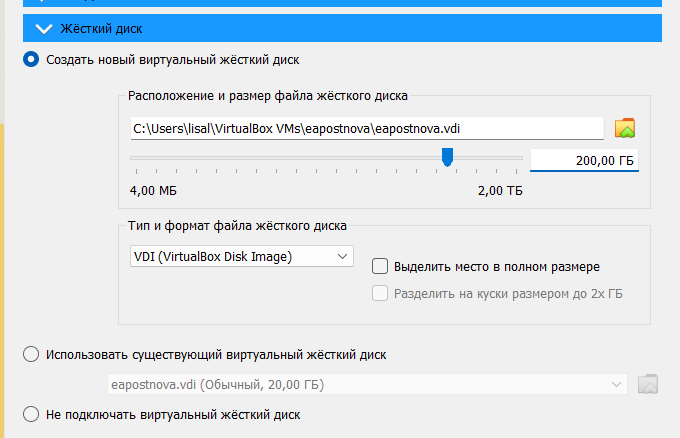
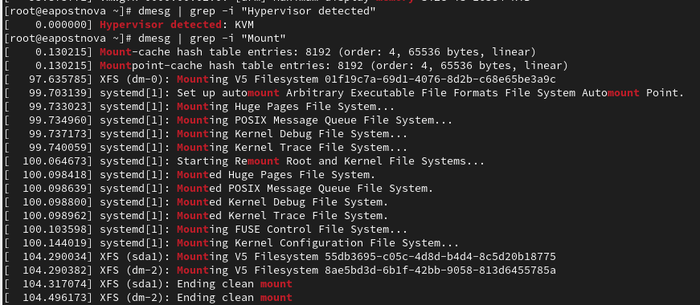

---
## Front matter
title: "Отчёт по лабораторной работе №1"
subtitle: "Основы информационной безопасности"
author: "Постнова Елизавета Андреевна, НКАбд-04-23"

## Generic otions
lang: ru-RU
toc-title: "Содержание"

## Bibliography
bibliography: bib/cite.bib
csl: pandoc/csl/gost-r-7-0-5-2008-numeric.csl

## Pdf output format
toc: true # Table of contents
toc-depth: 2
lof: true # List of figures
lot: true # List of tables
fontsize: 12pt
linestretch: 1.5
papersize: a4
documentclass: scrreprt
## I18n polyglossia
polyglossia-lang:
  name: russian
  options:
	- spelling=modern
	- babelshorthands=true
polyglossia-otherlangs:
  name: english
## I18n babel
babel-lang: russian
babel-otherlangs: english
## Fonts
mainfont: IBM Plex Serif
romanfont: IBM Plex Serif
sansfont: IBM Plex Sans
monofont: IBM Plex Mono
mathfont: STIX Two Math
mainfontoptions: Ligatures=Common,Ligatures=TeX,Scale=0.94
romanfontoptions: Ligatures=Common,Ligatures=TeX,Scale=0.94
sansfontoptions: Ligatures=Common,Ligatures=TeX,Scale=MatchLowercase,Scale=0.94
monofontoptions: Scale=MatchLowercase,Scale=0.94,FakeStretch=0.9
mathfontoptions:
## Biblatex
biblatex: true
biblio-style: "gost-numeric"
biblatexoptions:
  - parentracker=true
  - backend=biber
  - hyperref=auto
  - language=auto
  - autolang=other*
  - citestyle=gost-numeric
## Pandoc-crossref LaTeX customization
figureTitle: "Рис."
tableTitle: "Таблица"
listingTitle: "Листинг"
lofTitle: "Список иллюстраций"
lotTitle: "Список таблиц"
lolTitle: "Листинги"
## Misc options
indent: true
header-includes:
  - \usepackage{indentfirst}
  - \usepackage{float} # keep figures where there are in the text
  - \floatplacement{figure}{H} # keep figures where there are in the text
---

# Цель работы

Целью данной работы является приобретение практических навыков
установки операционной системы на виртуальную машину, настройки минимально необходимых для дальнейшей работы сервисов.

# Задание

1. Установка операционной системы на виртуальную машину, настройки минимально необходимых для дальнейшей работы сервисов.

2. Получить следующую информацию.

Версия ядра Linux (Linux version).

Частота процессора (Detected Mhz processor).

Модель процессора (CPU0).

Объем доступной оперативной памяти (Memory available).

Тип обнаруженного гипервизора (Hypervisor detected).

Тип файловой системы корневого раздела.

Последовательность монтирования файловых систем

# Выполнение лабораторной работы

Создайте новую виртуальную машину. Укажите имя виртуальной машины, тип
операционной системы — Linux, RedHat (64-bit). Укажите размер основной памяти виртуальной машины — 4096 МБ.
Задайте конфигурацию жёсткого диска — загрузочный,VDI (BirtualBox Disk
Image), динамический виртуальный диск.
Задайте размер диска — 200 ГБ).

{#fig:001 width=70%}

{#fig:001 width=70%}

{#fig:001 width=70%}

Запустите виртуальную машину, выберите English в качестве
языка интерфейса и перейдите к настройкам установки операционной системы.
Войдите в ОС под заданной вами при установке учётной записью. В меню
Устройства виртуальной машины подключите образ диска дополнений гостевой ОС.

Дождитесь загрузки графического окружения и откройте терминал. В окне
терминала проанализируйте последовательность загрузки системы, выполнив команду dmesg.

Получите следующую информацию.
1. Версия ядра Linux (Linux version).
2. Частота процессора (Detected Mhz processor).
3. Модель процессора (CPU0).
4. Объем доступной оперативной памяти (Memory available).
5. Тип обнаруженного гипервизора (Hypervisor detected).
6. Тип файловой системы корневого раздела.

{#fig:001 width=70%}

{#fig:001 width=70%}

{#fig:001 width=70%}

# Выводы

В результате данной работы я приобрела практические навыки
установки операционной системы на виртуальную машину, настройки минимально необходимых для дальнейшей работы сервисов.

